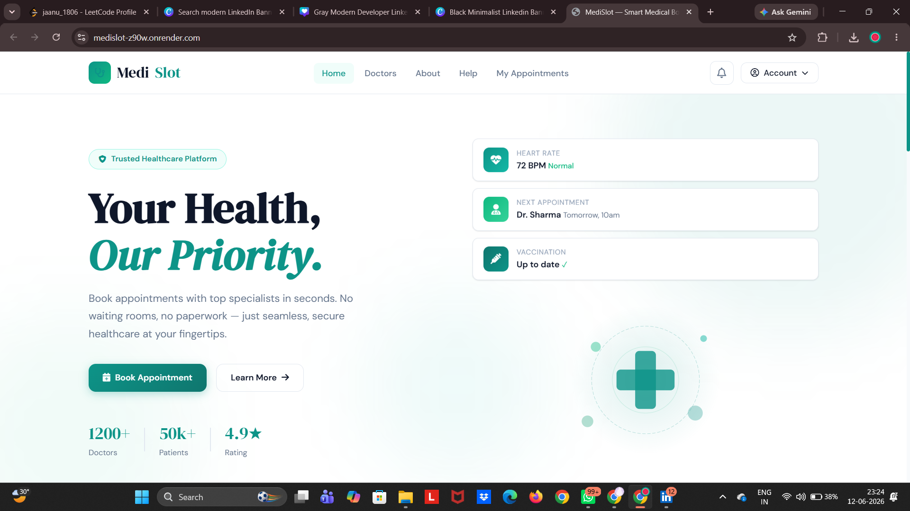
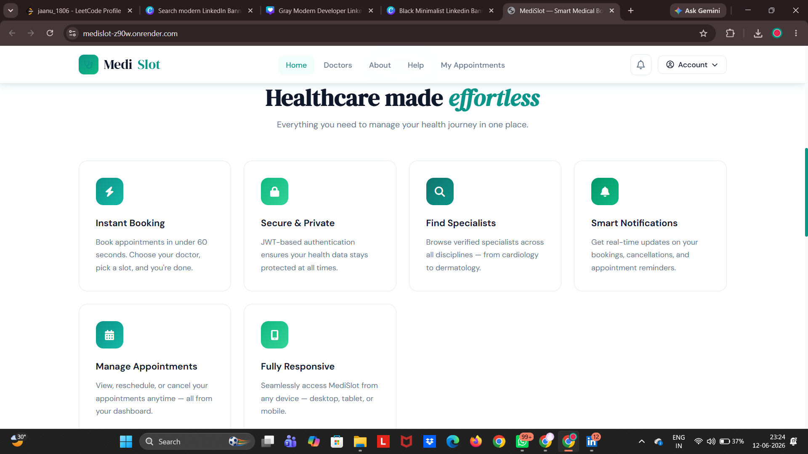
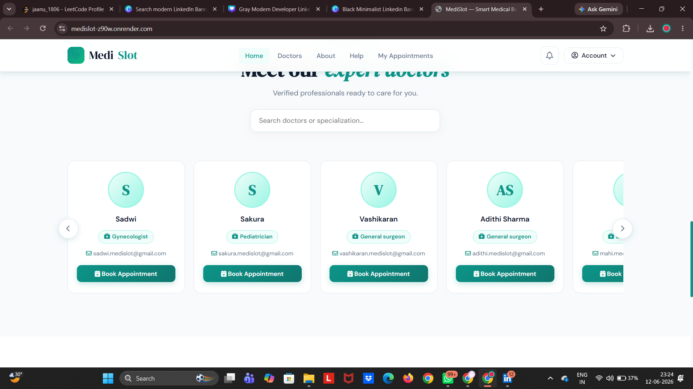
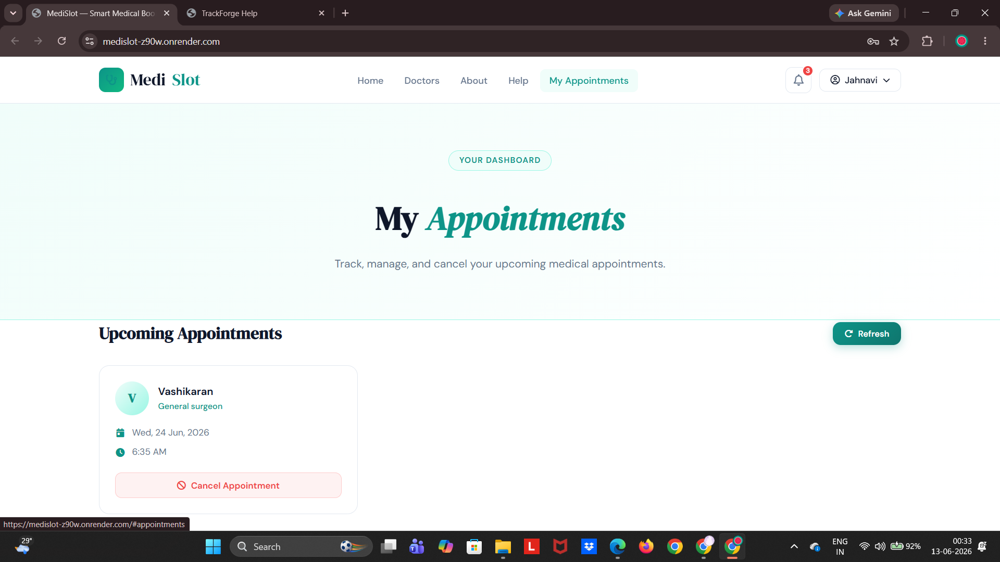

# 🏥 MediSlot

MediSlot is a modern healthcare appointment booking platform built with **FastAPI**, **SQLAlchemy**, **HTML**, **CSS**, and **JavaScript**. It enables patients to securely register, browse doctors, book appointments, and manage their healthcare scheduling through an intuitive user interface.

---

## 🚀 Features

- 🔐 JWT Authentication
- 👤 Patient Registration & Login
- 👨‍⚕️ Doctor Directory
- 📅 Appointment Booking System
- ⚡ Slot Conflict Validation
- 📋 My Appointments Dashboard
- 🔔 Notifications
- 🔍 Doctor Search
- 📱 Responsive User Interface

---

## 🖼️ Screenshots

### Home Page



---

### Features Section



---

### Doctor Directory



---

### Appointment Booking



---

### User Registration


---

## 🛠️ Tech Stack

### Frontend
- HTML5
- CSS3
- JavaScript

### Backend
- FastAPI
- SQLAlchemy
- SQLite

### Authentication
- JWT
- Passlib

---

## 📂 Project Structure

```bash
MediSlot/
│
├── static/
├── templates/
├── images/
│   ├── home.png
│   ├── appointment-demo.png
│   ├── doctors.png
│   ├── features.png
│   └── register.png
│
├── app.py
├── models.py
├── database.py
├── requirements.txt
└── README.md
```

---

## ⚙️ Installation

### Clone Repository

```bash
git clone https://github.com/jahnavipriya05/MediSlot.git
cd MediSlot
```

### Create Virtual Environment

```bash
python -m venv venv
```

### Activate Environment

#### Windows

```bash
venv\Scripts\activate
```

#### Linux / Mac

```bash
source venv/bin/activate
```

### Install Dependencies

```bash
pip install -r requirements.txt
```

---

## ▶️ Run Backend

```bash
uvicorn app:app --reload
```

Application will be available at:

```bash
http://127.0.0.1:8000
```

---

## 🌐 Run Frontend

Open the frontend using:

- VS Code Live Server

or

- Any static web server

---

## 🎯 Future Enhancements

- Email Notifications
- Doctor Dashboard
- Admin Panel
- Online Payments
- Appointment History Analytics
- Cloud Database Integration

---

## 👩‍💻 Author

**Jahnavi Priya**

Backend Development • FastAPI • Python • Generative AI

GitHub:
https://github.com/jahnavipriya05